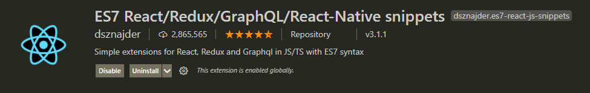
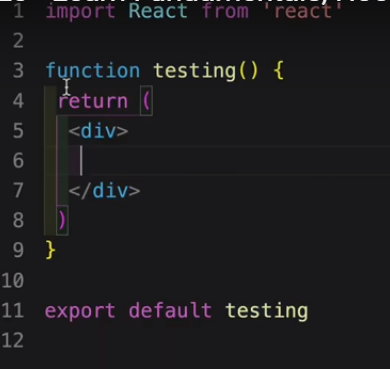
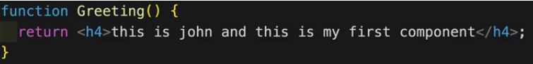
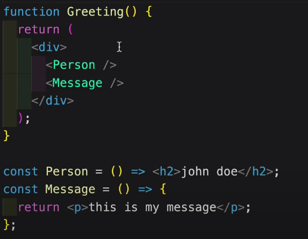
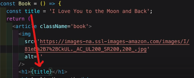
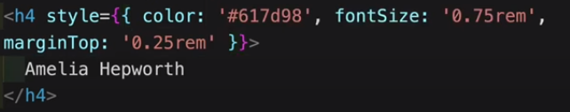
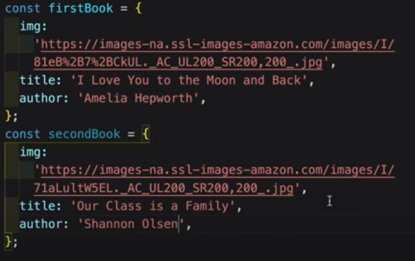
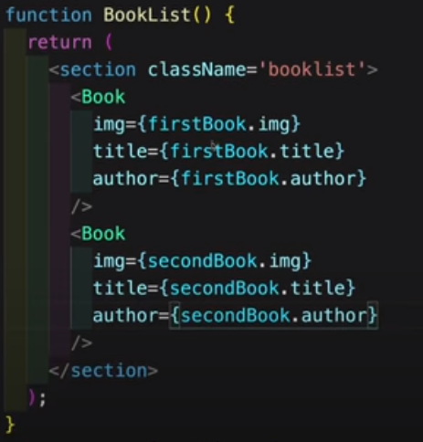
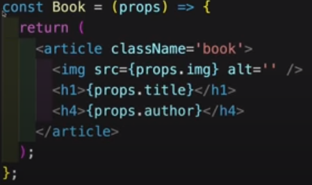

# React Crash Course
1. Prerequisites:
1.  1. Text Editor : Visual Studio Code
1.  2. Browser : Google Chrome
1.  3. Additional Extension : React Developer Tools
1. Install Node.js
1. Know basic terminal commands
1. Create a folder for your app and open terminal and write `npm init` and enter app name and skip the remaining
1.  - Always use lowercase letters for entering app name
1. Install Bootstrap 
1.  - `npm install bootstrap --save`
- **Note:** A folder `node_modules` with all the dependencies installed will appear
    - If you ever clone a react repo from GitHub ,If you don't see the node_modules folder just type `npm install` on your terminal
    - This will install the node_modules folder in your device
1. Install gatsby (Optional)
    - `npm install gatsby-cli -g`
1. To create react app with required modules in a folder type `npx create-react-app app_name`
1. Move to that folder `cd app_name`
1. Now you can start the development server in localhost:3000 by typing `npm start`
1. For better learning ,delete all the files from the `src` folder except `index.js` but clear the contents fron it
1. Open `index.js` and import react `import React from 'react'`
1. If you are creating a component keep the name starting with an uppercase letter 
    - So react knows that it is a component
- **Note:** The file `index.html` contains a div with id `root`.
    - This div contains the app (i.e) The app lives in that div
1. To render your component to `index.html` import `ReactDom`
    - `import ReactDom from 'react-dom'`
1. Now add the code `ReactDom.render(<ComponentName/>,document.getElementById('root'));` in your `index.js` file
1. Use ES7 extension for better programming
    - 
    - (i.e) If you type `rfce` it will type the code component
    - 
1. Always enclose your app in a function and write your component code in the return statement (COMPULSORY)
    - 
1. Use paranthesis in the return statement
    - The HTML tags inside the return statements are called `JSX`
1. Use can use only one parent tag and it may contain many tags inside it
    - You can use `<React.Fragment>` tag or an empty tag `<>` to enclose the remaining tags
    - Or you can use tags like `<section> , <article>` e.t.c for understanding
1. Always use camelCase for html attributes
    - For e.g for class type `className`
1. You can use nested components so that your code can be more understandable
    - 
1. The **React Developer Tools** extension can be used to identify the components from a page
    - Simply navigate to component tab in from console and you'll find it there
1. Always use `{}` to enter js line in the JSX tags
    - if name is a variable then use `{name}` to use the variable inside the JSX tag to use it
    - 
1. We can use CSS to style our website and it'll be comfortable if you know the basics of CSS.
1. CSS can be linked in 2 ways
    - By Inline CSS
    - By Seperate File
1. Inline CSS:
    - create a style attribute int your HTML(JSX) tag and enter the styles
    - 
1. Seperate File:
    - crete a file with .css extension and import it to your main js file using `import './file_name.css'`
    - And add your styles in that file
1. **Props** is nothing but arguments that contains an object that is passed from  the components using attributes
    - 
    - In the above image we declared two consts with the data inside
    - 
    - Then, we pass the data to the component
    - 
    - Now we can access them using props
    - [Refer this for explaination](https://www.youtube.com/watch?v=4UZrsTqkcW4&t=7780s)
